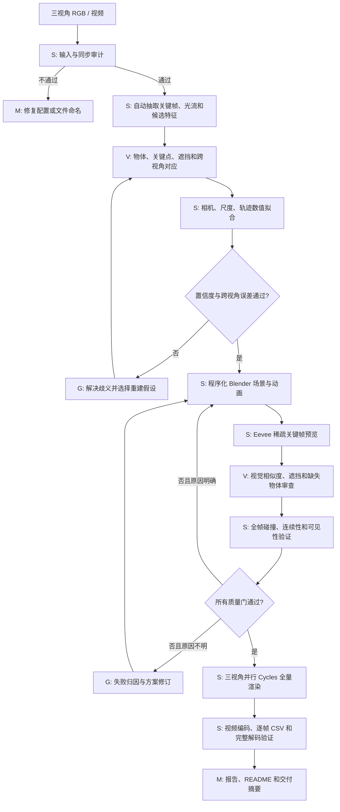
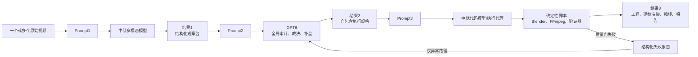

# Efficient ASTRA：机器人案例复盘与通用视频到 Blender 重建流水线

本文首先记录 GPT6-ASTRA 在一个三视角机器人案例中完成的工作，再基于这次执行设计一套面向任意视频内容、可复用的 ASTRA 3D 重建流水线。

> 请查看 `real_rgb` 的真机机器人操作视频（已转化为帧），利用 Blender 进行场景建模和动作重放，最后输出 `real_rgb` 和 `sim_rgb` 视频；三个视角都要有，且能逐帧对应。

文中时间为 Asia/Shanghai，主要来自文件完成时间、渲染日志、验证 JSON 和 Git 提交记录。输入 PNG 在请求开始时已经存在，不是 GPT6-ASTRA 生成的。

第 1—15 节是上述机器人任务的具体执行记录，因此会出现夹爪、笔、货架和三视角等案例字段。第 16 节是独立的通用方案：输入可以是一个或多个视频，主体可以是人、动物、车辆、机器人、刚体、关节物体、可变形物体或混合场景，相机也可以固定或移动。

## 1. 执行结果

本次执行把三路真实 RGB 帧重建为可编辑 Blender 场景，并输出了逐帧对齐的真实与模拟视频：

- 视角：`head`、`hand_left`、`hand_right`
- 每个视角：593 帧，编号 `000000.png`–`000592.png`
- 分辨率：640×480
- 假定播放帧率：30 fps
- 每路时长：19.766667 秒
- 对应规则：源帧 `n` → Blender 帧 `n+1` → 视频帧 `n`
- 最终 Blender 场景：`reconstruction/replay.blend`
- 最终场景 SHA-256：`4df6cc065916cb0990db9a9bb50895d69ccd8619f4897b804cba7cc729830391`
- 最终场景对象数：823
- 三路最终渲染均为 Cycles 64 samples、OPTIX、NVIDIA GeForce RTX 5090
- 全部 9 个输出视频通过 FFprobe 和 OpenCV 完整解码验证
- 全部 593 个记录姿态通过环境碰撞检查，最终碰撞对象对为 0

这是 RGB 驱动的视觉近似重放。没有使用真实相机标定、深度、机器人关节状态、控制指令、力反馈或动力学数据。

## 2. 执行层级标记

后文用以下标记说明每一步最适合由谁执行：

| 标记 | 执行层 | 适合的工作 |
|---|---|---|
| **[S]** | 确定性代码脚本 | 文件审计、帧计数、特征计算、数值优化、Blender 构建、渲染、编码、碰撞与完整性验证 |
| **[V]** | 视觉模型 | 物体识别、分割、关键点、遮挡判断、跨视角匹配、预览图质量审查 |
| **[M]** | 中低通用模型 | 配置生成、任务编排、日志摘要、常规代码维护、文档与报告生成 |
| **[G]** | GPT6 | 无标定多视角歧义、物体与相机关系推理、抓放事件解释、失败归因、关键重建方案和例外决策 |

这里的“必须用 GPT6”是本流水线的路由规则：这些步骤的输入存在开放世界歧义，低成本自动化结果不足以直接进入昂贵的全量渲染。它们也可以由有经验的人类 3D/机器人专家替代。

## 3. 按时间顺序的完整执行记录

### 3.1 请求开始：确认信息缺失并确定重建边界 [G]

GPT6-ASTRA 先确认是否存在原始帧率、相机标定、机器人关节或末端轨迹。用户回答“没有”。据此确定：

- 只依据 RGB 图像估计相机、尺度、遮挡区域和运动。
- 三视角按同名文件编号同步。
- 因源 PNG 没有时间元数据，暂按 30 fps 播放。
- 输出是视觉近似，不宣称恢复真实关节状态或物理动力学。

这一步需要 GPT6 或人类专家，因为它决定任务声明、误差边界和后续建模策略。配置文件的实际生成可交给 [M]。

### 3.2 2026-09-07 08:54—09:08：输入帧审计和真机视频编码 [S]

脚本检查了 `real_rgb/{head,hand_left,hand_right}`：

- 每路 593 张 RGB PNG。
- 编号连续，无缺帧。
- 分辨率统一为 640×480。
- 三路总计 1,779 张图像。
- PNG 没有可用的采集时间戳或帧率元数据。

随后编码：

```text
outputs/videos/real_rgb/head.mp4
outputs/videos/real_rgb/hand_left.mp4
outputs/videos/real_rgb/hand_right.mp4
```

FFprobe 和 OpenCV 均确认每路 593 帧、30 fps、19.766667 秒。报告写入 `outputs/source_video_validation.json`。

这一步应完全由脚本执行，不需要视觉模型或 GPT6。中低模型只负责解释失败日志。

### 3.3 09:08—09:11：准备运行环境和机器人资产 [S][M]

配置并验证：

- Blender 4.5.13 LTS
- FFmpeg/FFprobe 8.0.1
- Python、NumPy、OpenCV、SciPy、Pillow
- Cycles OPTIX 渲染
- NVIDIA GeForce RTX 5090

为提高夹爪外形可信度，引入 DH AG 系列夹爪资产：

- 来源：`https://github.com/ian-chuang/dh_ag95_gripper_ros2`
- 上游：`https://github.com/DH-Robotics/dh_gripper_ros`
- 固定提交：`fc4f80fdfb3acae5626df4359aec1401cb71a9a3`
- 保留 MIT 和 Apache-2.0 许可证
- 对复制的 CAD、URDF 和许可证文件保存 SHA-256

资产下载、哈希和许可证检查由 [S] 完成；常规依赖排错可由 [M] 完成。只有无法识别硬件、需要决定“复用哪种近似资产”时才升级到 [G] 或人工审核。

### 3.4 09:13：建立世界坐标并估计相机 [V][S][G]

从桌面、黑笔、笔筒和熊猫装饰等跨视角地标建立近似世界坐标：

| 相机 | 角色 | 焦距估计 | Blender 镜头 |
|---|---|---:|---:|
| `head` | 近似固定俯视 | 600 px | 33.75 mm |
| `hand_left` | 近似固定左腕视角 | 397.879 px | 22.381 mm |
| `hand_right` | 随右夹爪运动 | 344.728 px | 19.391 mm |

`hand_left` 的静态地标拟合 RMS 约为 1.298 px。相机结果保存在 `reconstruction/camera_estimates.json`。

推荐分工：

- [V] 提取地标、分割和跨视角候选对应。
- [S] 执行 PnP、束调整、三角化和重投影误差计算。
- [G] 只处理无标定尺度选择、错误对应、严重遮挡和多个数值解都合理的情况。

### 3.5 09:13—09:19：视觉跟踪和任务阶段划分 [V][S][G]

`scripts/analyze_motion.py` 完成：

- 绿色笔筒检测。
- 右腕青色 LED 检测和跟踪。
- 桌面、黑笔、笔筒和熊猫静态地标记录。
- 背景光流估计，辅助判断腕部相机运动。
- 使用 `head` 与 `hand_left` 观测三角化腕部 LED。
- 在三个视角中检查抓取、移动和释放阶段。

采集了 230 个腕部 LED 三角化点，覆盖帧 311–540；左视角平均重投影误差约 1.80 px。另对 25 个关键帧标注右夹爪外壳、夹爪间隙、腕部和可见笔段。

动作被划分为：

| 源帧 | 动作阶段 |
|---|---|
| 0–55 | 初始静止，夹爪打开 |
| 56–193 | 向桌面上的黑笔靠近 |
| 194–212 | 完成末段接近 |
| 213–235 | 合拢夹爪并抓住黑笔 |
| 236–279 | 把黑笔抬离桌面 |
| 280–363 | 向笔筒移动并旋转腕部 |
| 364–456 | 将黑笔降低到笔筒中 |
| 457–485 | 打开夹爪，黑笔落入笔筒 |
| 486–592 | 夹爪撤离 |

像素检测、光流和三角化适合 [V]+[S]。抓取成立、何时释放以及遮挡状态下的物体归属属于语义事件，应由 [G] 审核；高置信度、接触几何明确的数据可由视觉模型直接通过。

### 3.6 09:20：构建夹爪、相机和机械臂几何 [S][M][G]

`scripts/robot_geometry.py` 创建：

- 左右 DH AG 风格夹爪
- CAD 主体、底座、内外连杆、手指和指垫
- 金属腕部、相机支架、相机外壳、镜头和传感器
- 相机线缆和夹爪线缆
- 白色腕部和机械臂近似模型

夹爪开合由连续的指垫间距控制。右腕相机作为右夹爪的子对象随夹爪运动。由于 RGB 中无法识别白色机械臂型号，隐藏臂段采用可编辑几何和解析连接。

已有模型和模板的生成可由 [S] 或 [M] 完成。无法辨认硬件时，“使用近似几何还是寻找替代 CAD”的决定需要 [G] 或人工批准。

### 3.7 09:23—09:32：渲染 smoke test 和左夹爪拟合 [S][V]

完成 Cycles/OPTIX 性能测试，并创建支持以下功能的渲染脚本：

- 单视角或三视角渲染
- 指定起止帧
- Cycles/Eevee
- OPTIX、CUDA 等设备选择
- 无 GPU 时回退 CPU
- PNG 完整性检查
- `--resume` 断点续渲
- 每个视角保存独立 manifest

先渲染少量关键帧，验证场景、相机、输出路径和断点续渲。

随后对固定左夹爪进行多视角非线性拟合：

- `head` 地标 RMS 约 0.873 px。
- `hand_left` 近距离自视图无法与估计相机几何一致拟合。
- 左夹爪近处投影比例和手指角度被记录为已知限制。

数值拟合和 smoke test 属于 [S]；预览图的遮挡、比例和可读性检查适合 [V]。只有两个视角要求冲突、无法自动选择取舍时才升级到 [G]。

### 3.8 09:32—09:43：构建初版 Blender 场景 [S][V][G]

`scripts/build_replay.py` 生成：

- 桌面、桌腿和浅色桌布
- 中空绿色竹节笔筒
- 附着的熊猫、花朵和竹叶
- 黑色记号笔、笔帽、接缝和笔夹
- 左右夹爪、腕部相机、线缆和机械臂
- 房间、墙体和金属笼架
- 材质、软光源和渲染设置

黑笔被建为独立对象，以便释放后脱离夹爪。第一版场景于 09:36 完成，并进行了第一轮全序列渲染：

| 视角 | 帧数 | 耗时 |
|---|---:|---:|
| `head` | 593 | 107.7 秒 |
| `hand_left` | 593 | 104.2 秒 |
| `hand_right` | 593 | 102.4 秒 |

这轮全渲染用于暴露动作和相机问题，后来被新的动作拟合与环境修复版本替换。

程序化几何创建应由 [S] 完成，关键帧预览由 [V] 审查。场景中“哪些不可见结构可以合理补全”需要 [G] 制定约束。

### 3.9 09:42—09:48：拟合完整动作并重建场景 [V][S][G]

`scripts/fit_motion.py` 将人工关键点、自动 LED 轨迹、静态地标、重投影误差和姿态先验组合为 31 个核心姿态关键帧，再生成完整 593 帧轨迹：

- 源帧 235 建立黑笔相对夹爪的刚性姿态。
- 源帧 235–456 保持完整相对位置和旋转。
- 源帧 457 释放黑笔。
- 源帧 457–474 使用 smoothstep 位置插值和四元数 SLERP 模拟落笔。
- 源帧 474 后黑笔保持稳定。
- 右腕相机始终刚性连接右夹爪。

轨迹保存到 `reconstruction/motion.json`。09:43 重新生成场景，09:48 完成第二轮全序列渲染。

[S] 负责优化、插值、四元数连续性和关键帧烘焙；[V] 提供观测；[G] 审核接触事件、遮挡时的物体姿态以及落笔近似方式。

### 3.10 动作连续性验证 [S]

数值审计得到：

- 右夹爪单帧最大平移约 17.13 mm。
- 右夹爪单帧最大旋转约 7.32°。
- 黑笔单帧最大平移约 9.44 mm。
- 黑笔单帧最大旋转约 3.04°。
- 抓取阶段黑笔在夹爪局部坐标中的最大位置漂移约 `6.1×10⁻¹⁷ m`。
- 抓取阶段轴向旋转漂移为 0°。
- Blender 与 `motion.json` 的位置和旋转差异均为 0。
- 黑笔从源帧 474 起稳定。
- 黑笔最低表面与估计笔筒底面间隙约 2.41 mm。

这些均为确定性检查，应由 [S] 完成。脚本失败时先由 [M] 摘要；只有数据本身相互矛盾时才交给 [G]。

### 3.11 09:56：处理“右墙穿模、右侧货架未建模”反馈 [V][S][G]

收到用户反馈后，先保存返修前场景：

```text
outputs/revisions/wall_shelf_before.blend
```

对旧场景的 593 帧执行碰撞和可见性基线检查：

- 环境碰撞对象对：103
- 静态桌面碰撞对象对：67
- 货架网格：55
- `hand_left` 货架可见采样：帧 0 为 0、帧 235 为 0、帧 400 为 6、帧 592 为 0

用户反馈和视觉模型负责发现画面级问题 [V]；碰撞和可见射线负责量化 [S]；“移动墙体、重建货架还是修改相机”的归因属于 [G]。本次判断为环境问题，保持相机和动作不变。

### 3.12 09:59—10:01：重建墙体、笼架和商品货架 [S][V][G]

`scripts/shelf_geometry.py` 新建独立三维货架：

- 绿色圆管框架
- 四层薄金属托盘
- 正面和侧面护栏
- 木色侧板和背板
- 螺栓、脚垫
- 38 袋商品和储物罐
- 鼓胀透明袋体、热封边、标签和内部食品块

`scripts/environment_geometry.py` 同时完成：

- 把笼架整体移到桌面后方。
- 删除穿过桌面和机器人运动范围的立柱、网格和整片隔板。
- 把右墙移到完整货架后方。
- 把货架放到桌面右侧、机器人扫掠区域外。
- 将货架旋转约 −25°，使开口朝向腕部视角。

程序化建模由 [S] 完成；物品类别、颜色、密度和整体外观可由 [V] 提取；复杂空间布置与遮挡取舍由 [G] 决定。

### 3.13 10:02：确认返修没有改变动作 [S]

脚本逐帧比较返修前后的：

- `head`
- `hand_left`
- `hand_right`
- `Right_AG_gripper`
- `Black_marker`

帧范围、帧率、分辨率、相机内参、父子关系和全部 593 帧世界矩阵完全一致，最大差异为 0。环境返修没有改变相机或动作。

### 3.14 10:03—10:04：最终碰撞、结构和视觉验证 [S][V]

`scripts/validate_environment.py` 使用：

1. 世界坐标 AABB 粗检测
2. BVH 三角形相交
3. 闭合网格射线奇偶包含测试

检查全部 593 个姿态，接触容差为 0.2 mm。最终结果：

| 指标 | 返修前 | 返修后 |
|---|---:|---:|
| 环境碰撞对象对 | 103 | 0 |
| 静态桌面碰撞对象对 | 67 | 0 |
| 货架网格数 | 55 | 423 |
| `hand_left` 帧 0 可见货架采样 | 0 | 1,448 |
| `hand_left` 帧 235 可见货架采样 | 0 | 1,431 |
| `hand_left` 帧 400 可见货架采样 | 6 | 1,384 |
| `hand_left` 帧 592 可见货架采样 | 0 | 1,354 |

最终精确检测了 2,175 个粗检测候选，全部被证明为 AABB 假阳性，真实碰撞为 0。

碰撞、变换和可见射线属于 [S]；最终画面是否“像货架”、商品是否可辨认属于 [V]。检测数值通过但画面仍明显错误时升级到 [G]。

### 3.15 10:04—10:10：最终全序列渲染 [S]

最终场景使用 Cycles、64 samples、OPTIX GPU、OPTIX denoiser 和 persistent scene cache。三个视角采用独立任务并行渲染：

| 视角 | 渲染帧数 | 耗时 |
|---|---:|---:|
| `head` | 593 | 343.916 秒 |
| `hand_left` | 593 | 344.317 秒 |
| `hand_right` | 593 | 343.569 秒 |

每路均从源帧 0 渲染到 592，无跳帧，无续渲遗留。全量渲染应完全由 [S] 完成。

### 3.16 10:09：固化可重复运行的流水线入口 [S][M]

在最终渲染完成前，建立统一入口 `scripts/run_pipeline.sh`，支持：

```bash
bash scripts/run_pipeline.sh
bash scripts/run_pipeline.sh --use-existing-scene
bash scripts/run_pipeline.sh --resume
bash scripts/run_pipeline.sh --use-existing-frames
```

流水线会在全量渲染前执行全部 593 帧的环境碰撞检查，发现碰撞时停止；通过后才渲染、编码并验证。脚本和配置维护可由 [S]+[M] 完成。

### 3.17 10:10：视频打包和逐帧验证 [S]

生成六路独立视频：

```text
outputs/videos/real_rgb/{head,hand_left,hand_right}.mp4
outputs/videos/sim_rgb/{head,hand_left,hand_right}.mp4
```

生成两个三视角横排视频：

```text
outputs/videos/real_rgb.mp4
outputs/videos/sim_rgb.mp4
```

两者均为 1920×480，列顺序为 `head`、`hand_left`、`hand_right`。

生成一个六宫格对比视频：

```text
outputs/videos/real_sim_three_views.mp4
```

规格为 1920×960，上排真实、下排模拟。九个视频全部为 H.264、593 帧、30 fps、19.766667 秒，并通过完整解码。

同时生成：

- `outputs/frame_correspondence.csv`：逐行记录源 PNG、Blender 帧、视频帧和播放时间。
- `outputs/compare.html`：六图同步逐帧对比器。
- `outputs/video_validation.json`：九个视频的编码和解码验证结果。

这些步骤均应由 [S] 完成。

### 3.18 10:33—11:28：工程化、GitHub 和文档 [S][M]

全量输出完成后，增加了依赖文件、可复制的运行时配置、`.gitignore`、中英文 README 和 BibTeX 引用。

Git 提交：

```text
fa1a2e8 Add RGB-to-Blender reconstruction pipeline
bb7b7cc Add bilingual README and citation
```

仓库：`https://github.com/hku-sail/Real2Sim_GPT6_ASTRA`

脚本、配置、常规代码重构和文档可交给 [M]+[S]。GPT6 不应被用于视频编码、Git 状态检查或格式化文档。

### 3.19 2026-09-09：补充确认 `real_rgb` 来源 [S]

后续检查 `Put_the_pen_from_the_table_into_the_pen_holder.tar.gz`：

- `real_rgb` 来自三路 `episode_000000.mp4`。
- 三路 MP4 实际均可解码出 593 帧。
- 与现有 `real_rgb` 做全量 RGB 像素哈希比较，1,779 张图像全部一致。
- 数据集 `episodes.jsonl` 将 Episode 0 标为 591 帧，与视频实际帧数不一致。
- 当前工程按视频实际内容使用 593 帧；最后两帧超出元数据声明的轨迹长度。

这类来源、帧数和哈希核验必须由 [S] 执行，不能只依赖语言模型阅读文件名后猜测。

## 4. 当前执行中可以优化的地方

本次流程成功交付，但出现了两类可以避免的成本：

1. 动作拟合和环境布局尚未冻结时执行了两轮三视角全序列渲染。
2. 墙体穿模和货架遮挡在完整渲染后才被用户发现。

改进后的顺序应为：

- 先用脚本审计和视觉模型抽取关键帧。
- 只渲染 8–16 个代表帧的 Eevee 预览。
- 在预览阶段完成相机、动作、墙体、货架和遮挡检查。
- 运行全部姿态的快速几何验证。
- 所有质量门通过后才启动 Cycles 全量渲染。
- 三个视角并行渲染。
- 全量阶段只允许脚本执行和断点续渲，不再让 GPT6逐帧参与。

## 5. Efficient ASTRA 3D 重建流水线



### 5.1 阶段路由表

| 阶段 | 默认执行者 | 可替代执行者 | GPT6 介入条件 | 产物 |
|---|---|---|---|---|
| 输入清点 | [S] | [M] 解释日志 | 不介入 | `input_audit.json` |
| 帧同步/时间轴 | [S] | [M] 生成配置 | 多流存在非线性漂移且无时间戳 | `timeline.json` |
| 关键帧抽取 | [S] | [V] 补充语义帧 | 不介入 | `keyframes.json` |
| 物体和关键点 | [V] | 人工标注 | 遮挡或跨视角身份冲突 | `observations.json` |
| 相机和尺度拟合 | [S] | 视觉 SfM/SLAM | 多个解数值相近但语义不合理 | `camera_estimates.json` |
| 场景资产选择 | [M]+[S] | 资产检索系统 | 硬件无法识别或许可/外形取舍 | `asset_manifest.json` |
| 环境建模 | [S] | [M] 生成 Blender 代码 | 隐藏结构、墙体和货架布局不确定 | `.blend` 初版 |
| 动作事件识别 | [V] | 人工审核 | 接触、抓住、释放时刻有歧义 | `events.json` |
| 轨迹拟合 | [S] | 优化器/IK 工具 | 多视角约束互相冲突 | `motion.json` |
| 稀疏预览 | [S] | 无 | 不介入 | 关键帧 PNG |
| 画面审查 | [V] | 人工审核 | 自动评分低但原因不明 | `visual_audit.json` |
| 碰撞和连续性 | [S] | 无 | 仅在必须改变建模假设时介入 | `geometry_audit.json` |
| 全量渲染 | [S] | 渲染农场 | 不介入 | `sim_rgb` |
| 视频打包 | [S] | 无 | 不介入 | MP4、CSV |
| 文档和日志摘要 | [M] | [S] 模板 | 只在需要解释重大限制时介入 | README、报告 |

### 5.2 推荐质量门

#### Gate A：输入完整性 [S]

- 三视角帧数相同。
- 编号连续。
- 分辨率和色彩通道一致。
- 没有损坏图像。
- 原始视频帧数、元数据轨迹长度和解码结果分别记录，不能混为一个值。

任何失败都停止后续流程。

#### Gate B：相机和观测质量 [S][V]

建议使用可配置阈值：

- 静态地标 RMS ≤ 3 px：自动通过。
- 3–8 px：视觉模型复核对应点。
- > 8 px：升级 GPT6 或人工重新解释相机、尺度或错误对应。
- 关键点置信度低或两个视角给出互斥深度：不得直接进入全量建模。

近距离腕部自视图容易违反简单针孔模型，应单独标记为诊断视角，避免一个异常视图破坏全局拟合。

#### Gate C：动作和事件 [S][V][G]

- 轨迹不能出现非有限值。
- 四元数必须连续并归一化。
- 抓取期间物体在夹爪局部坐标中保持刚性。
- 释放前后必须有明确状态转换。
- 物体运动峰值超出局部统计分布时，自动生成前后帧预览。
- 接触事件无法由几何和视觉同时确认时才升级 GPT6。

#### Gate D：稀疏视觉预览 [V]

至少检查：

- 首帧
- 接近开始
- 闭爪
- 抬起
- 运输中段
- 笔位于笔筒上方
- 释放
- 物体稳定
- 末帧

每个关键时刻都要检查三个视角。任何墙体穿模、主要物体缺失、相机看向错误方向或严重比例错误，都应在此阶段修复。

#### Gate E：全帧几何验证 [S]

- 全部离散姿态碰撞对象对必须为 0，除非清单明确允许某个接触对。
- 对支持关系单独建白名单，不能简单跳过整类碰撞。
- 检查机器人、桌面、墙、笼架和货架。
- 检查目标货架在指定视角和关键帧中有可见表面采样。
- 环境返修后逐帧确认相机和动作矩阵没有意外变化。

#### Gate F：最终视频 [S]

- 所有独立视频帧数一致。
- FFprobe 和完整解码帧数一致。
- 分辨率、fps、时长和 PTS 通过。
- 三视角拼接顺序固定。
- `frame_correspondence.csv` 行数与源帧数一致。
- `real_rgb`、`sim_rgb` 和对比视频使用同一时间轴。

## 6. 推荐的最小 GPT6 调用点

高效版本不让 GPT6 参与每一帧，只在以下四个关口调用：

1. **重建假设审批**：没有标定和深度时，决定世界尺度、相机角色、可见物体清单和不可见结构补全原则。
2. **动作语义审批**：确认抓取、刚性附着、释放和稳定阶段，解决遮挡导致的事件歧义。
3. **预览失败归因**：当视觉模型发现明显不一致，但脚本无法判断是相机、几何、材质还是轨迹问题时选择修复方向。
4. **最终限制审批**：判断哪些误差可以作为已知限制交付，哪些必须阻止全量渲染。

以下工作不应使用 GPT6：

- 遍历文件和数帧
- PNG/视频完整性检查
- FFmpeg 编码
- 哈希和来源核验
- 矩阵、四元数和连续性计算
- 数值优化器的逐次迭代
- Blender 批量建模命令执行
- 碰撞检测
- 全量渲染
- Git 状态、格式化和普通文档翻译

## 7. 中低模型可承担的工作

中低模型适合作为常驻编排器：

- 根据模板生成项目配置和命令。
- 选择并调用现有脚本。
- 摘要 Blender、FFmpeg 和验证日志。
- 将脚本错误归类为输入、依赖、资源、渲染或编码问题。
- 维护 README、运行说明、引用和产物清单。
- 生成 Blender Python 的常规模板代码。
- 在质量门失败时收集证据，再决定是否升级 GPT6。

中低模型不应自行确认存在严重遮挡的抓取事件，也不应在跨视角冲突时直接选择一个相机解。

## 8. 视觉模型可承担的工作

视觉模型适合批量处理：

- 场景物体清单和粗分割。
- 桌面、墙、货架、笔筒、笔、夹爪和机器人部件检测。
- 夹爪尖端、腕部 LED、笔端点和笔筒口关键点。
- 遮挡状态与物体可见区间。
- 跨视角候选匹配。
- 稀疏 Blender 预览与真实帧的语义对比。
- 检测缺失物体、错误颜色、严重比例错误和相机朝向错误。

视觉模型的输出必须包含坐标、置信度和遮挡标记，之后由脚本做几何计算；不能让自然语言描述直接驱动全量动画。

## 9. 代码脚本应承担的工作

脚本是流水线主体，目标占据绝大多数运行时间和调用次数：

- 数据清点、帧同步和时间轴
- 光流、颜色检测和特征匹配
- PnP、三角化、束调整、IK 和轨迹插值
- Blender 对象、材质、相机和关键帧生成
- 稀疏与全量渲染
- 断点续渲和渲染 manifest
- AABB、BVH 和包含测试
- 轨迹与 `.blend` 一致性检查
- 视频编码、拼接和 PTS 验证
- HTML 对比器和 CSV 对应表生成
- 哈希、许可证和复现信息

所有脚本输出应结构化为 JSON/CSV，供中低模型摘要并供 GPT6 在升级时读取。

## 10. 推荐运行配置

建议为每个任务保存一个声明式配置，例如：

```yaml
task: put_pen_into_holder
input:
  root: real_rgb
  views: [head, hand_left, hand_right]
  expected_resolution: [640, 480]
  fps: 30
  timing_source: assumed

frame_mapping:
  source_start: 0
  blender_offset: 1
  output_offset: 0

preview:
  engine: eevee
  frames: [0, 55, 212, 235, 300, 400, 457, 474, 592]

final_render:
  engine: cycles
  samples: 64
  denoise: true
  parallel_views: true
  resume: true

quality_gates:
  static_landmark_rms_auto_pass_px: 3
  static_landmark_rms_escalate_px: 8
  require_zero_unapproved_collisions: true
  require_equal_view_frame_counts: true
  require_complete_video_decode: true

routing:
  orchestrator: medium_model
  perception: vision_model
  ambiguity_escalation: gpt6
  deterministic_work: scripts
```

## 11. 推荐执行顺序

```text
01  脚本审计输入、帧数、分辨率和元数据
02  脚本建立统一时间轴并记录任何视频/轨迹长度冲突
03  脚本抽取代表帧、光流和候选特征
04  视觉模型批量输出物体、关键点、遮挡和置信度
05  脚本拟合相机、尺度和三维轨迹
06  低置信度或跨视角冲突才升级 GPT6
07  脚本生成 Blender 初版场景和动画
08  只用 Eevee 渲染少量关键帧
09  视觉模型检查三视角构图、缺失物体和遮挡
10  脚本检查全部姿态碰撞、连续性和目标可见性
11  失败原因不明确才升级 GPT6；否则脚本直接返修
12  所有质量门通过后，三视角并行 Cycles 全量渲染
13  脚本编码九类视频/布局并完整解码验证
14  中低模型生成报告；GPT6只审批重大限制
```

## 12. 交付验收清单

- [ ] 三视角源帧数和编号连续性已记录
- [ ] 原始视频帧数与轨迹元数据长度分别验证
- [ ] 相机、尺度和关键地标有结构化文件
- [ ] 动作阶段、抓取帧、释放帧和稳定帧明确
- [ ] Blender 场景可编辑且没有隐藏的绝对路径依赖
- [ ] 三相机、机器人和目标物体都有完整动画
- [ ] 稀疏预览覆盖全部关键动作阶段和三个视角
- [ ] 全部姿态通过碰撞与轨迹连续性检查
- [ ] 环境返修不会改变相机和动作矩阵
- [ ] `sim_rgb` 每路帧数与 `real_rgb` 完全相同
- [ ] 独立视频、三视角视频和六宫格视频均完成
- [ ] FFprobe 与完整解码验证通过
- [ ] CSV 能逐行追踪源帧、Blender 帧和视频帧
- [ ] 已知视觉、标定和物理限制写入报告

## 13. 当前实现对应文件

| 功能 | 文件 |
|---|---|
| 视觉跟踪与相机初估 | `scripts/analyze_motion.py` |
| 左夹爪拟合 | `scripts/fit_left_gripper.py` |
| 右夹爪和黑笔轨迹拟合 | `scripts/fit_motion.py` |
| Blender 场景与动画生成 | `scripts/build_replay.py` |
| 环境、桌面、笔筒和房间 | `scripts/environment_geometry.py` |
| 右侧商品货架 | `scripts/shelf_geometry.py` |
| 机器人和夹爪 | `scripts/robot_geometry.py` |
| 三视角批量渲染 | `scripts/render_sequence.py` |
| 全帧环境验证 | `scripts/validate_environment.py` |
| 视频编码和逐帧验证 | `scripts/package_videos.py` |
| 完整入口 | `scripts/run_pipeline.sh` |
| 相机估计 | `reconstruction/camera_estimates.json` |
| 视觉轨迹 | `reconstruction/vision_tracks.json` |
| 动作轨迹 | `reconstruction/motion.json` |
| 可编辑场景 | `reconstruction/replay.blend` |
| 最终重建审计 | `outputs/reconstruction_validation.json` |
| 环境碰撞与货架可见性 | `outputs/environment_validation.json` |
| 视频完整性 | `outputs/video_validation.json` |

## 14. 已知限制

- 相机和尺度来自 RGB 估计，不是真实标定。
- 白色机械臂和隐藏关节为几何补全。
- `hand_right` 在约源帧 400 的仰角与真实画面仍有明显差异。
- `hand_left` 中近距离左夹爪的投影比例和手指角度不完全一致。
- 熊猫笔筒比例、背景商品和灯光是近似重建。
- 源帧 457–474 的落笔由运动学插值生成，没有模拟力、摩擦或接触动力学。
- “逐帧对应”表示索引和播放时间一致，不表示像素或真实关节状态完全一致。
- Episode 0 的轨迹元数据声明 591 帧，但三个源视频实际各有 593 帧；严格使用状态/动作数据时必须显式处理最后两帧。

## 15. Efficient ASTRA 的模型预算原则

推荐的资源分配目标是：

- **脚本优先**：所有可验证、可复现的确定性工作。
- **视觉模型批处理**：图像中的观测提取和预览质量检查。
- **中低模型常驻**：编排、配置、日志和文档。
- **GPT6按异常调用**：只处理低置信度、跨视角冲突、隐藏结构推理和重大失败归因。

GPT6 的价值集中在少数会改变全局重建结果的决策点；一旦假设被确定，后续建模、拟合、渲染和验证都应固化为脚本。这能减少昂贵模型调用，也能避免在环境和动作尚未冻结时重复全量渲染。

## 16. 通用视频到 Blender 方案：直接 GPT6 基线与三级级联

本节不预设输入是机器人视频，也不预设三视角、固定相机或抓放任务。输入可以是一个或多个描述同一时空事件的视频；内容可以包括人、动物、车辆、机器人、刚体、关节物体、可变形物体和混合场景；镜头可以固定、移动、变焦、切换或存在遮挡。最终需要重建哪些实体、输出哪些视角，也由视频证据和用户任务共同决定。

“逐帧一致”在这套通用流程中包含两层要求：

1. **时间与索引一致**：源视频帧、Blender 时间轴帧和输出视频帧之间有明确、可逆、经过验证的映射。
2. **可见内容一致**：在指定输出相机中，场景布局、相机运动、实体外观、姿态、形变、交互、遮挡和状态变化尽可能匹配对应源帧，并由预先声明的指标与人工复核共同验收。

只靠单目 RGB 视频时，绝对尺度、被遮挡结构、材质参数和真实三维运动可能没有唯一解。因此，“一致”必须由可测的二维重投影、轮廓重合、光流、感知相似度、关键事件帧和逐帧映射来定义，不能无条件解释为像素完全相同或真实物理状态唯一恢复。

### 16.1 直接 GPT6 基线与公平对比

直接方案把原始视频和下面这一条 Prompt 一起交给 GPT6：

```text
请根据输入的视频，利用blender重建场景和动作，生成的blender动画要求和输入视频逐帧一致
```

其数据流为：

```text
原始视频 + 上述 Prompt → GPT6 → Blender 场景、动画、渲染结果与验证材料
```

三级级联方案的数据流为：

```text
Prompt1 + 原始视频 → 中低多模态模型 → 结果1
Prompt2 + 结果1 → GPT6 → 结果2
Prompt3 + 结果2 → 中低代码模型或执行代理 → 结果3
```

第三阶段接收的是 **结果2 + Prompt3**，不是结果1。结果2必须包含第三阶段所需的全部事实、裁决、文件引用、参数、约束和验收规则。

为了公平比较，两种方案必须使用同一批原始视频、相同 Blender/渲染工具、相同算力预算，并交付相同类型的 `.blend`、逐帧渲染、视频、帧映射和验证报告。比较时应记录总模型成本、GPT6 输入 token/视频时长、人工干预次数、首次验收通过率、重跑耗时和最终误差。

| 维度 | 直接 GPT6 基线 | 三级级联 |
|---|---|---|
| GPT6 输入 | 原始视频和一条开放式任务 Prompt | 中低模型生成的结构化结果1与 Prompt2 |
| GPT6 工作 | 视频理解、假设裁决、方案设计、代码与执行编排集中完成 | 重点审计证据、解决歧义并编译执行规格 |
| 中间契约 | 由 GPT6 临场建立 | 结果1、结果2有固定 schema |
| 调试方式 | 需要从完整上下文定位错误 | 可以定位到观察、裁决或执行阶段 |
| 缓存与复用 | 视频或任务变化时常需重新处理长上下文 | 视频观察包、执行规格和渲染阶段可分别缓存 |
| 可重复性 | 依赖单次端到端输出是否完整 | 版本化 Prompt、schema、哈希和质量门更易复现 |
| 主要优势 | 接口最短，适合小规模试验、短视频和快速建立上限 | 降低 GPT6 的长视频处理量，适合批量任务和持续迭代 |
| 主要风险 | 简短 Prompt 没有明确输出 schema、误差指标和失败策略 | 结果1遗漏事实时会污染后续阶段，需要证据覆盖率检查 |

直接 GPT6 基线应始终保留。它既是最简单的用户入口，也是评价三级级联是否真正降低成本、提高稳定性的参照组。

### 16.2 三级级联图



原始视频仍保存在执行环境中，供阶段3生成的脚本按结果2里的路径和哈希读取。“第三阶段不输入结果1”只限制模型上下文，不限制 Blender、FFmpeg 或验证脚本读取结果2明确声明的源媒体。

### 16.3 三个阶段的职责边界

| 阶段 | 模型 | 主要任务 | 边界 |
|---|---|---|---|
| 阶段1 | 中低多模态模型 | 读取视频，提取镜头、实体、运动、形变、交互、关键帧和不确定性 | 不把不可见结构或未知标定写成事实，不启动全量渲染 |
| 阶段2 | GPT6 | 审计结果1，解决身份、时空、几何和运动歧义，形成完整执行规格 | 不承担批量编码、渲染等确定性机械工作 |
| 阶段3 | 中低代码模型/执行代理 | 严格执行结果2，生成脚本，调用 Blender/FFmpeg，运行质量门并打包 | 不默默修改 GPT6 冻结的语义、坐标、时间或验收约束 |

### 16.4 Prompt1：用中低模型生成通用结果1

Prompt1 负责提取证据和候选假设，不直接承诺完成重建。建议使用下面的通用模板：

```text
你是视频场景、相机和运动的结构化分析模型。

输入：一个或多个描述同一时空事件的原始视频。内容可能是人、动物、车辆、
机器人、刚体、关节物体、可变形物体或混合场景；相机可能固定或移动。
任务：提取 Blender 场景与逐帧动画重建所需的可观察证据、候选关系和不确定性。

要求：
1. 对每个视频报告文件标识、帧数、分辨率、帧率/时间戳、镜头切换、损坏帧和同步关系。
2. 分析相机是固定、移动、变焦还是切镜，并给出内参、外参和畸变的候选或 unknown。
3. 建立场景清单，区分静态环境、动态刚体、关节主体、可变形主体、光源和背景。
4. 为每个实体建立跨帧轨迹、身份关联、可见性、遮挡、2D 框、掩码和关键点。
5. 按显著的场景、镜头或运动变化划分时间段，记录出现、消失、接触、分离、形变和状态变化。
6. 为每个关键变化选取代表帧；多视频只有在有证据时才建立跨视角或跨镜头对应。
7. 每条结论区分 observed、inferred、assumed，并附来源、帧范围和置信度。
8. 不虚构标定、深度、尺度、隐藏几何、骨骼、材质、动力学或同步关系。
9. 严格按 result1.schema.json 输出；未知值写 null 或 unknown，不用散文替代必填字段。

最终只输出结果1，不生成 Blender 场景，不执行全量渲染。
```

### 16.5 结果1：通用结构化观察包

建议结果1采用一个 JSON 主文件，并附证据索引和必要的关键帧图：

```text
result1/
├── result1.json
├── keyframe_contact_sheets/
└── evidence_manifest.csv
```

`result1.json` 的最小通用结构如下：

```json
{
  "schema_version": "astra.result1.v2",
  "task": {
    "instruction": "<user reconstruction instruction>",
    "success_condition": "<user-defined visual and delivery criteria>"
  },
  "inputs": {
    "videos": [],
    "file_hashes": {},
    "decoded_metadata": {},
    "synchronization_hypotheses": [],
    "timing_confidence": "unknown"
  },
  "shots_and_views": [],
  "camera_observations": [],
  "scene_inventory": [],
  "entity_tracks": [],
  "motion_segments": [],
  "state_transitions": [],
  "interactions": [],
  "geometry_cues": [],
  "keyframes": [],
  "observations_2d": [],
  "cross_video_matches": [],
  "occlusions": [],
  "appearance_notes": [],
  "candidate_assumptions": [],
  "contradictions": [],
  "unknowns": [],
  "confidence_summary": {},
  "evidence_index": []
}
```

每个重要结论都应记录 `source_video`、`shot_id`、`frame_index` 或时间范围、`evidence_type`、`confidence`、`visibility` 和 `inference_level`。结果1可以保留多个候选相机、身份、深度、拓扑或运动解释，供 GPT6 在下一阶段统一裁决。

### 16.6 Prompt2：让 GPT6 把结果1编译为结果2

Prompt2 要求 GPT6 检查证据覆盖率和内部矛盾，并把开放式视频解释编译为可执行规格：

```text
你是 ASTRA 视频到 Blender 重建的高级审计器和执行规格编译器。

输入：结果1结构化观察包。
目标：纠正观察错误，解决可裁决的时空、相机、实体、几何和运动冲突，选择一套
内部一致、可执行、可验证的 Blender 重建方案，并输出自包含的结果2。

必须完成：
1. 审计源文件、帧数、时间轴、镜头、相机运动、实体身份、运动段、形变和状态变化。
2. 对候选假设作出 accept、reject 或 unresolved 裁决，并记录证据和置信度。
3. 定义每个源视频帧到 Blender 帧及对应输出帧的映射；异步视频分别定义映射。
4. 选择坐标系、尺度约定、场景布局、相机重建、资产来源、材质、灯光和遮挡策略。
5. 按实体类型选择刚体动画、骨骼绑定、形状键、布料/软体、粒子或其他实现。
6. 给出相机动画、实体动画、约束、交互和状态切换的逐帧或可插值规格。
7. 把阶段3需要的全部信息写进结果2，不引用结果1中未附带的内容。
8. 区分 frozen_fields 与 tunable_fields，并定义稀疏预览和全量渲染质量门。
9. 将无法安全决定且会阻止执行的问题写入 blockers；blockers 非空时禁止全量渲染。
10. 为每项裁决保留源视频、镜头和帧号证据链。

结果2必须能在不重新提供结果1的情况下由中低代码模型执行。
```

### 16.7 结果2：自包含、已裁决的执行规格

结果2不是结果1的简短摘要，而是阶段3可以直接读取的编译产物：

```text
result2/
├── execution_spec.json
├── reconstruction_plan.md
├── asset_manifest.json
├── observation_tables/
│   ├── cameras.json
│   ├── entities.json
│   ├── motion.json
│   └── constraints.json
└── evidence_index.csv
```

`execution_spec.json` 的最小通用结构如下：

```json
{
  "schema_version": "astra.result2.v2",
  "status": "ready",
  "input_contract": {
    "videos": [],
    "source_frame_ranges": {},
    "timeline": {
      "fps": null,
      "frame_count": null,
      "mapping_policy": "explicit per-source-frame mapping"
    },
    "input_hashes": {}
  },
  "frame_mapping": {
    "source_to_blender": {},
    "source_to_output": {}
  },
  "resolved_scene": {
    "coordinate_system": {},
    "scale_policy": "documented relative scale unless metric evidence exists",
    "environment": [],
    "spatial_relations": [],
    "materials": [],
    "lighting": [],
    "hidden_geometry_policy": "minimal editable approximation"
  },
  "resolved_cameras": [],
  "resolved_entities": [],
  "resolved_motion": {
    "segments": [],
    "state_transitions": [],
    "interactions": [],
    "constraints": []
  },
  "rigging_and_simulation_strategies": [],
  "asset_decisions": [],
  "blender_build_spec": {},
  "preview_spec": {},
  "render_spec": {
    "output_views": []
  },
  "output_contract": {},
  "quality_gates": [],
  "frozen_fields": [],
  "tunable_fields": [],
  "accepted_limitations": [],
  "decision_log": [],
  "blockers": []
}
```

结果2必须同时满足：自包含、无悬空引用、机器可执行、机器可验证、证据可追溯、状态明确。只有 `status=ready` 且 `blockers=[]` 时才能进入 Prompt3。无法用纯文本充分表达的证据可以随结果2附带关键帧裁剪、掩码、关键点或轨迹文件；它们属于结果2包本身。

### 16.8 Prompt3：用中低模型执行结果2

Prompt3 只负责忠实实现已经裁决的方案：

```text
你是 ASTRA Blender 执行代理。

输入：GPT6生成的结果2自包含执行规格。
目标：严格按照结果2构建、验证并交付结果3。

执行规则：
1. 验证结果2 schema、status、blockers、源文件路径、哈希和时间映射。
2. 不重新解释任务语义，不修改 frozen_fields。
3. 将确定性工作实现为可重复运行的 Python、Blender Python 或 shell 脚本。
4. 建立场景、相机、资产、绑定、动画、形变、状态切换、材质和灯光。
5. 先渲染 preview_spec 指定的帧和输出相机，并执行全部预览质量门。
6. 必过质量门失败时停止，输出 failure_report.json，不自行降低标准。
7. 预览通过后，渲染 render_spec.output_views 要求的全部帧；视角数量不得硬编码。
8. 按 frame_mapping 生成源视频、重建视频和逐帧对比材料。
9. 使用 FFprobe 和完整解码验证帧数、时间戳、分辨率、时长和帧映射。
10. 输出可编辑 Blender 工程、可重跑脚本、运行日志、验证报告和已知限制。

若结果2信息不足，返回结构化 blocker，不从常识补造相机、尺度、几何或运动。
```

### 16.9 结果3：通用最终交付包

推荐结果3采用与主体和视角名称无关的目录：

```text
result3/
├── reconstruction/
│   ├── scene.blend
│   ├── camera_estimates.json
│   ├── animation.json
│   └── asset_manifest.json
├── scripts/
│   ├── build_scene.py
│   ├── render_sequence.py
│   ├── validate_scene.py
│   └── package_videos.py
├── renders/
│   └── <output_view>/
├── videos/
│   ├── source/
│   └── reconstruction/
├── comparison/
│   ├── frame_correspondence.csv
│   └── synchronized_comparison.mp4
├── reports/
│   ├── reconstruction_validation.json
│   ├── geometry_and_motion_validation.json
│   ├── video_validation.json
│   └── failure_report.json
└── README.md
```

`failure_report.json` 只在失败时存在。成功交付要求：结果2没有 blocker；所有必过质量门通过；要求的每个输出视角和帧均已生成；Blender 工程可编辑且可由脚本重建；视频可完整解码；每个输出帧都能追溯到对应源帧和 Blender 帧。具体项目可以给 `source` 与 `reconstruction` 配置领域别名，但通用 schema 不依赖这些别名。

### 16.10 网页端使用方式

三级方案可以通过网页模型和本地执行环境协作完成：

1. 向中低多模态模型上传一个或多个原始视频和 Prompt1，下载结果1。
2. 向 GPT6 上传结果1和 Prompt2，下载自包含结果2。
3. 向中低代码模型上传结果2和 Prompt3，得到脚本包、执行说明或工程文件。
4. 在具备 Blender、FFmpeg 和所需 CPU/GPU 的环境运行阶段3脚本；若网页模型能直接调用这些工具，也可由其执行。

Prompt、schema 和工具链都应版本化；原始视频、结果1和结果2都应记录 SHA-256；每个阶段只依赖明确上传或在输入包中引用并校验的文件，不能依赖未导出的聊天历史。

### 16.11 缓存、复用与成本控制

- 原始视频不变时，可以复用结果1。
- 只改变重建假设或验收标准时，从阶段2重新运行。
- 只改变脚本实现、渲染质量或输出布局时，可以复用结果2，从阶段3开始。
- 阶段3的确定性故障由脚本或中低模型处理；只有失败指向场景解释、身份、相机、隐藏结构或运动歧义时才回到 GPT6。

建议缓存键：

```text
result1_cache_key = SHA256(video_hashes + prompt1_version + result1_schema_version)
result2_cache_key = SHA256(result1_hash + prompt2_version + result2_schema_version)
result3_cache_key = SHA256(result2_hash + prompt3_version + toolchain_versions)
```

### 16.12 异常回路

正常流程只调用 GPT6 一次。阶段3失败时按以下规则路由：

| 失败类型 | 处理者 | 是否重新调用 GPT6 |
|---|---|---|
| 文件缺失、路径、依赖、编码或 Blender API 错误 | [S][M] | 否 |
| GPU 内存不足、超时或渲染任务调度失败 | [S][M] | 否 |
| 数值越界且修复范围已在 `tunable_fields` 中定义 | [S][M] | 否 |
| 实体身份、镜头关系或状态变化的判断错误 | [G] | 是 |
| 多视频几何、时间或身份约束互相矛盾 | [G] | 是 |
| 改善一个要求会破坏另一个冻结要求 | [G] | 是 |
| 用户改变任务成功条件 | [G] | 是 |

需要 GPT6 修订时输入：

```text
当前结果2 + failure_report.json + Prompt2-Repair
```

GPT6 输出 `result2_revision_N`，第三阶段随后只接收：

```text
result2_revision_N + Prompt3
```

结果1仍不回传给第三阶段。

### 16.13 三级方案与细粒度实现的关系

三级级联是模型之间的通用接口，前文机器人案例中的脚本和质量门则是阶段3的一种具体实现：

- 阶段1内部可调用视频解码、抽帧、检测、分割、跟踪、光流、SfM/SLAM 和元数据脚本。
- 阶段2由 GPT6处理会改变全局方案的歧义，并把结果编译成自包含规格。
- 阶段3调用 Blender、几何优化、绑定、动画、仿真、渲染、编码和验证工具。

单条短视频可以先运行直接 GPT6 基线建立质量上限。批量任务、长视频、多轮修改或网页端交接更适合三级级联。两条路线使用同一验收协议，才能判断级联节省的成本是否以可接受的重建误差为代价。
